# Charm & Grace Cosmetics Store Website

Charm & Grace is a PHP and MySQL-based eCommerce website developed for a cosmetics store. The system includes both a customer-facing website and an admin management panel. Customers can browse beauty products, view product details, manage shopping activities, and interact with the store, while admins can manage products, categories, brands, orders, delivery methods, reviews, coupons, and customer information.

This project was developed as part of an academic eCommerce web development project. It focuses on database integration, CRUD operations, admin management, customer functionality, and responsive web design.

---

## Features

### Customer Side

- Customer registration and login
- Product browsing
- Product detail pages
- Product images and shade options
- Shopping cart functionality
- Order placement
- Customer profile management
- Review and rating system

### Admin Side

- Admin login system
- Admin dashboard
- Product management
- Category management
- Brand management
- Order management
- Customer management
- Delivery method management
- Coupon and special offer management
- Review management
- Product stock and shade quantity management

---

## Technologies Used

- PHP
- MySQL / MariaDB
- HTML5
- CSS3
- Bootstrap
- JavaScript
- jQuery
- phpMyAdmin
- XAMPP / MAMP for local development

---

## Project Structure

```text
Charm&Grace_Website/
│
├── Admin/              # Admin dashboard and management pages
├── Customer/           # Customer-facing pages
├── uploads/            # Uploaded product and profile images
├── images/             # Static website images
├── videos/             # Website video files
├── db_connect.php      # Database connection file
├── cosmetics_store.sql # Database file
├── README.md           # Project documentation
└── LICENSE
```

---

## Database Setup

1. Open phpMyAdmin.
2. Create a new database for the project.
3. Import the provided SQL file into the database.
4. Update the database connection details in `db_connect.php` if needed.

Example local database connection:

```php
$server = "localhost";
$user = "root";
$password = "";
$database = "cosmetics_store";
```

Make sure the database name in `db_connect.php` matches the database name created in phpMyAdmin.

---

## How to Run Locally

1. Install a local server environment such as XAMPP or MAMP.

2. Copy the project folder into the local server directory.

For XAMPP:

```text
/Applications/XAMPP/htdocs/
```

For MAMP:

```text
/Applications/MAMP/htdocs/
```

3. Start Apache and MySQL from XAMPP or MAMP.

4. Open phpMyAdmin in your browser.

For XAMPP:

```text
http://localhost/phpmyadmin
```

For MAMP:

```text
http://localhost:8888/phpMyAdmin
```

5. Create a new database and import the provided SQL file.

6. Update the database connection details in `db_connect.php` if needed.

7. Open the project in your browser using `localhost`.

Example:

```text
http://localhost/your-project-folder-name/
```

Admin side example:

```text
http://localhost/your-project-folder-name/Admin/adminLogin.php
```

Customer side example:

```text
http://localhost/your-project-folder-name/Customer/user_login.php
```

---

## Screenshots

Add project screenshots inside a folder called `screenshots`.

Example folder structure:

```text
screenshots/
├── home-page.png
├── product-page.png
├── product-details.png
├── admin-dashboard.png
└── product-management.png
```

## Screenshots

Project screenshots are stored inside the `screenshots` folder.

### Home Page


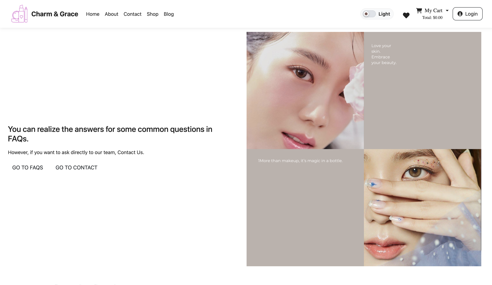

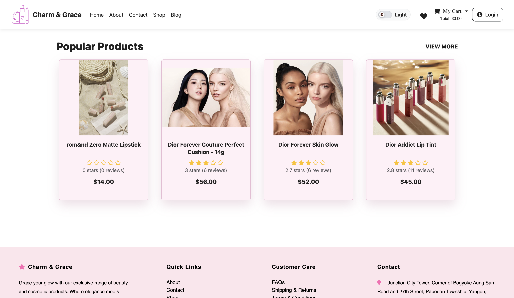

### Shop Page

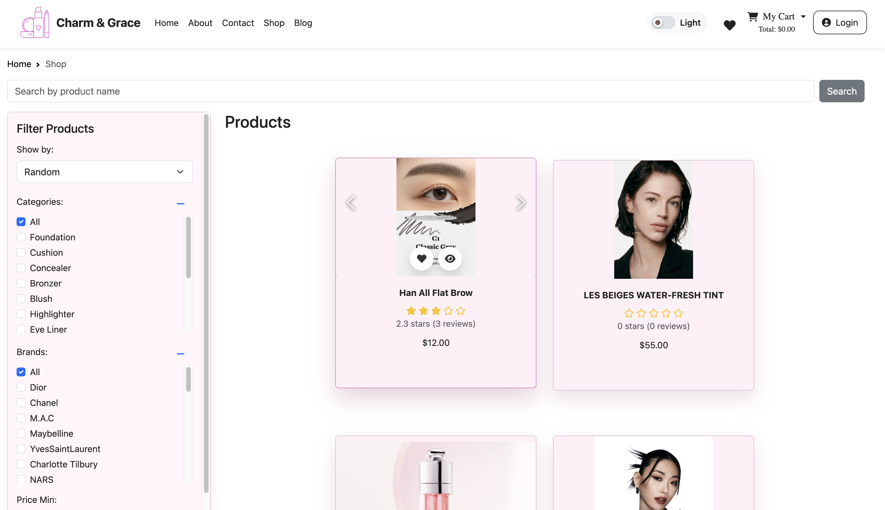

### Product Detail Pages

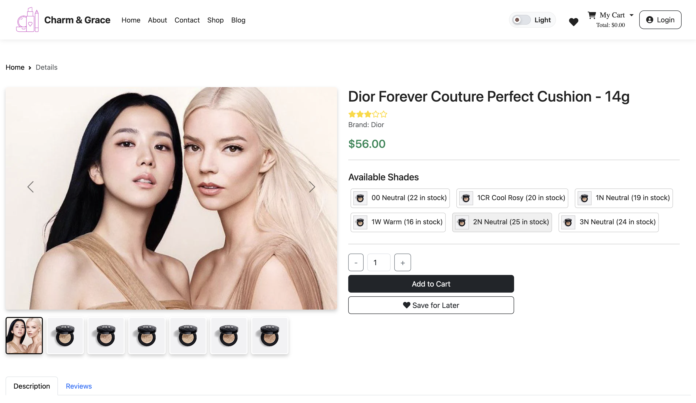

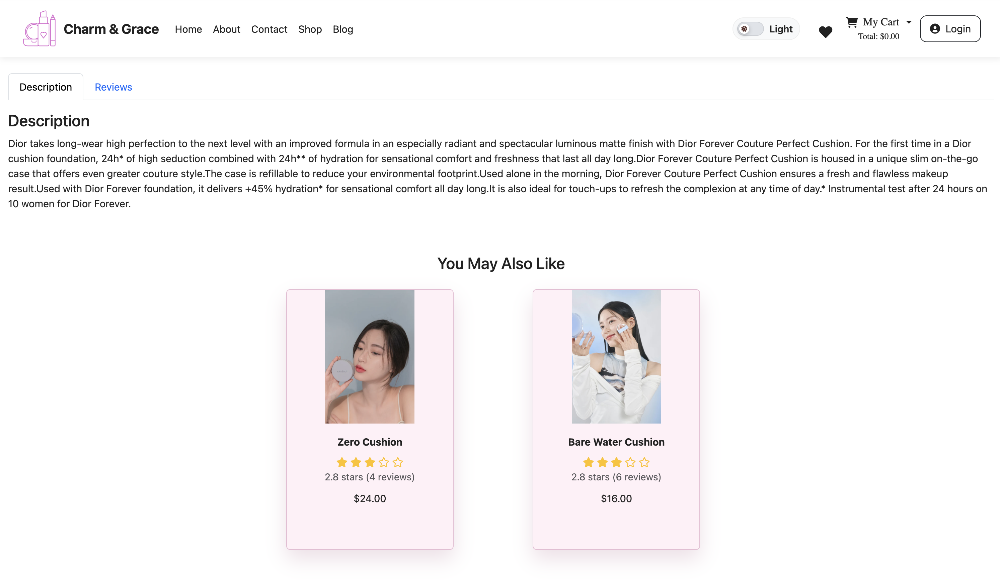

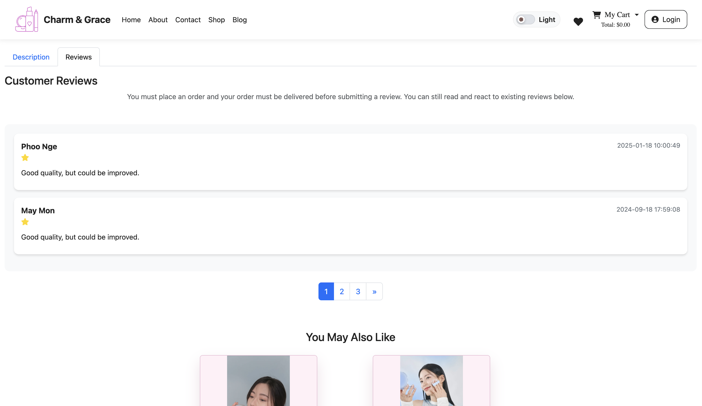

### Login / Access Page

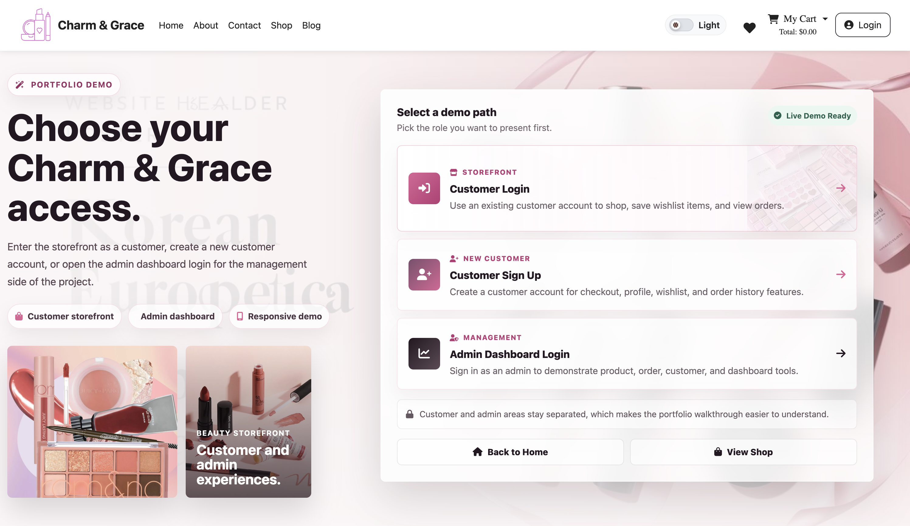

### Admin Dashboard

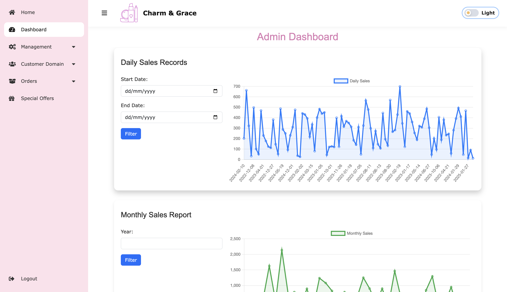

### Admin Product Management

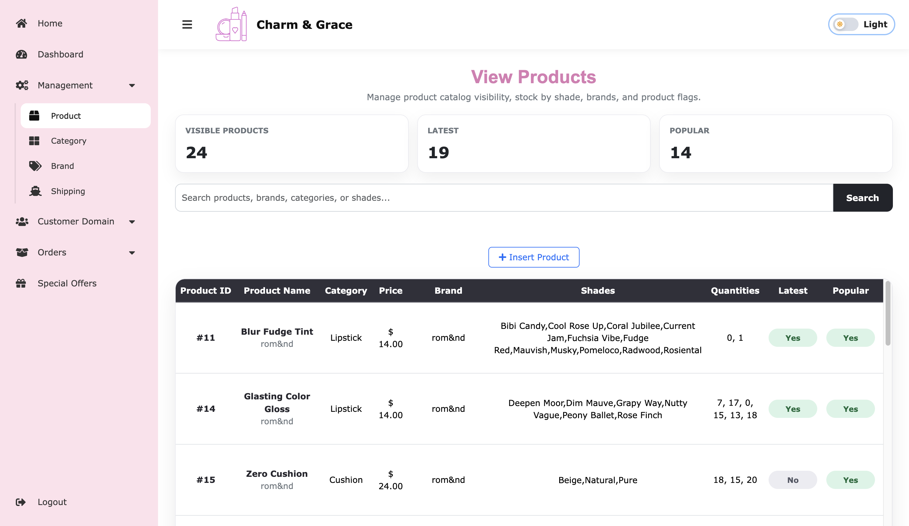

### Blog Page

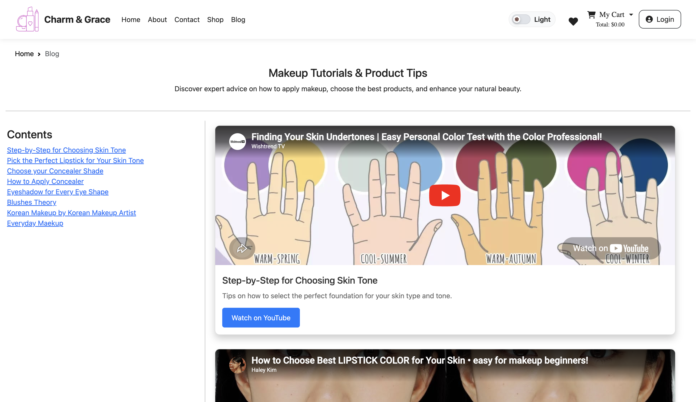

### Contact Page

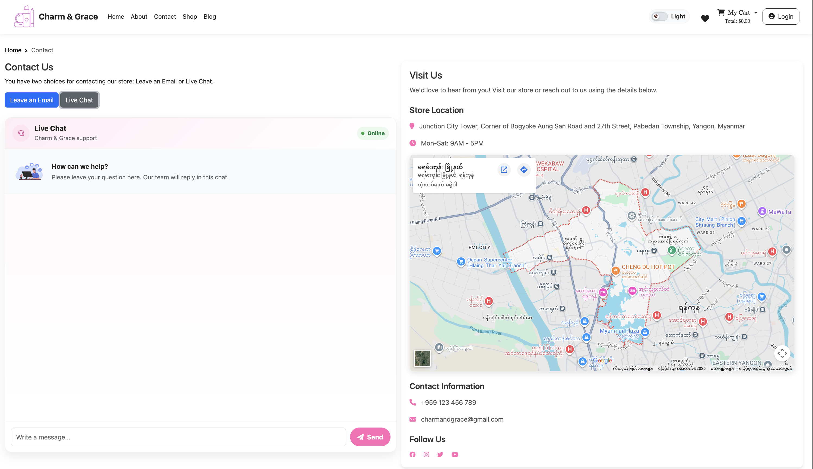

---

## Future Improvements

- Improve product filtering and searching
- Add online payment integration
- Improve image upload validation
- Add password reset functionality
- Add email confirmation for orders
- Improve admin dashboard analytics
- Improve mobile responsiveness
- Add stronger security for public deployment
- Improve product recommendation features

---

## Author

Developed by **Thiri Winyati**

GitHub: [ThiriWinyati](https://github.com/ThiriWinyati)

---

## Note

This project was created for academic and learning purposes. It demonstrates the use of PHP, MySQL, database design, CRUD operations, and web development techniques for building a cosmetics eCommerce website.
